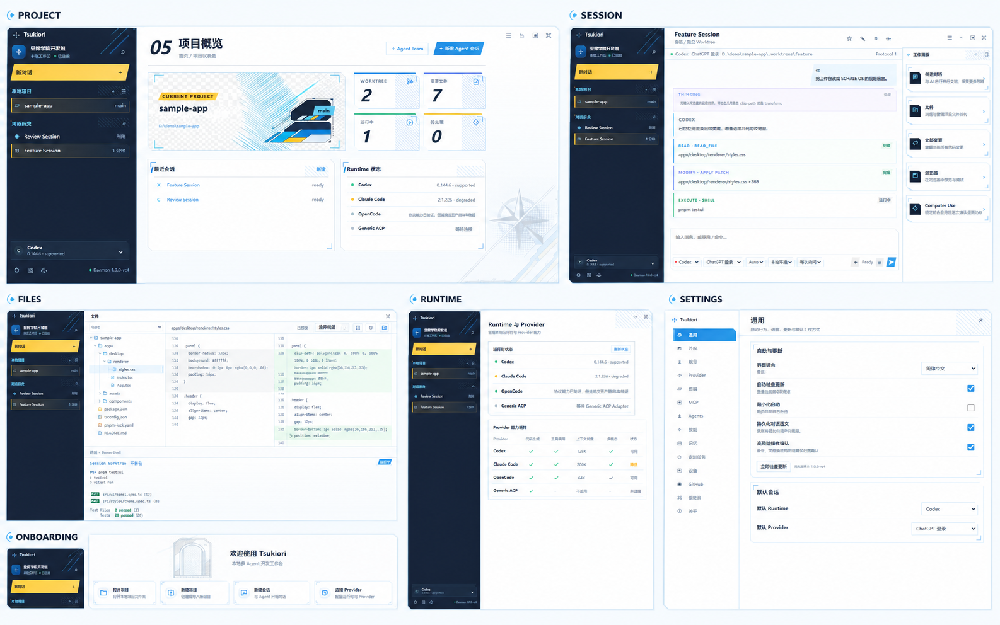

# Tsukiori 完整 UI/UX 设计稿 V1.1

本设计稿以当前可运行桌面端为基础，延续《蔚蓝档案》启发的蓝白学院科技感与 SCHALE 式信息层级，同时使用 Tsukiori 自有品牌、图标和原创插图，不复制游戏角色、Logo 或原作素材。

## 交付范围

- 1 张 ImageGen 完整产品视觉总板。
- 5 张可直接随应用打包的原创位图资产。
- 13 张主工作区、工作面板和弹窗设计稿。
- 19 张设置页面设计稿。
- 共 38 张 PNG 图片，所有页面稿基于 1600 × 1000 的真实 Electron 渲染。



## 设计原则

1. **本地优先可见**：项目、Worktree、Runtime、Provider 和权限状态始终能在首屏被识别。
2. **学院科技感**：深海军蓝导航、冰蓝画布、青色技术线、黄色主行动色、切角、斜线网纹与测量刻度构成统一语言。
3. **高信息密度但不拥挤**：用三栏结构容纳项目导航、主任务流和工作面板；弹窗承载设置与创建流程。
4. **原生能力不伪装**：`supported`、`degraded`、`unknown` 保持明确区分。
5. **可访问动态效果**：按钮、面板和状态动画必须响应 `reduce-motion`。

## 布局基线

| 区域 | 基线尺寸 | 说明 |
| --- | ---: | --- |
| 设计画布 | 1600 × 1000 | 完整截图与视觉验收基线 |
| 标题栏 | 40 px | 品牌、全局折叠入口与窗口操作区 |
| 左侧项目栏 | 300 px | 小于 1300 px 时收敛到 240 px，可折叠到 64 px |
| 右侧工作面板 | 360 px | 用户可拖拽，范围由应用约束到 260–720 px |
| 底部终端 | 220 px | 会话内可折叠 |
| 主内容最小宽度 | 620 px | 防止对话、Diff 和设置表单失去可读性 |

## 色彩与几何

| Token | 值 | 用途 |
| --- | --- | --- |
| Ink | `#14243d` / `#16233a` | 左栏、图标底座、强调文字 |
| Primary | `#249ce8` | 选中、主要按钮、技术描边 |
| Cyan | `#6fd3f5` | 次级技术线、图标、连接轨道 |
| Tray | `#d5e6f4` / `#e3eff9` | 仪表盘和大面积背景 |
| Amber | `#ffc63d` / `#ffd45c` | 新对话、主行动、告警提示 |
| Mint | `#47d7b1` | 健康、完成、已连接 |
| Violet | `#8c78ff` | Thinking、Agent 活动与特殊状态 |

卡片使用 7–12 px 的切角；斜线纹理只用于标题尾部、空状态和状态块，不覆盖正文；阴影保持弱化，主要依赖 1 px 描边建立层级。

## 原创图片资产

应用内资产位于 `apps/desktop/renderer/assets/generated/v1.1/`：

- `onboarding-hero.png`：Onboarding 左文右图主视觉。
- `project-worktrees.png`：项目、Worktree 分支与安全合并主视觉。
- `capability-hub.png`：Runtime、Provider、MCP、Skills、Memory、Agent 等能力拓扑。
- `work-panel-watermark.png`：右侧工作面板低对比门廊水印。
- `multi-agent-empty-state.png`：Agent Team 与能力列表空状态。

ImageGen 最终提示词记录在 [PROMPTS.md](./PROMPTS.md)。

## 页面设计稿

主流程截图位于 `screens/`：

- `01-onboarding.png`
- `02-project-dashboard.png`
- `03-session-ready.png`
- `04-session-conversation.png`
- `05-work-panel-home.png`
- `06-work-panel-attention.png`
- `07-work-panel-files.png`
- `08-work-panel-changes.png`
- `09-work-panel-browser.png`
- `10-work-panel-computer-use.png`
- `11-dialog-new-session.png`
- `12-dialog-agent-team.png`
- `13-work-panel-integration.png`

设置截图位于 `screens/settings/`，覆盖：通用、外观、账号、Provider、终端、MCP、Agents、技能、记忆、定时任务、Token 用量、Trace、诊断、项目、设备、GitHub、快捷键、账单和关于。

## 动效规范

- 普通按钮：`120–160 ms`，轻微位移或颜色切换；禁止缩放造成布局抖动。
- 主按钮：悬停亮度提升并沿切角方向移动 `1 px`。
- 左右面板：使用现有 `--motion-panel`，拖拽期间关闭过渡。
- 会话活动：仅旋转/脉冲状态标记，不移动正文。
- 设置页切换：内容淡入 `120 ms`，导航高亮立即响应。
- `reduce-motion` 开启时：关闭扫光、位移、旋转和自动脉冲，保留颜色/边框状态变化。

## 重新生成页面稿

```powershell
pnpm capture:design
```

脚本使用临时用户数据目录和脱敏 Fixture，退出后删除临时状态；不会读取真实项目 Prompt、源码、API Key 或 Runtime 原始事件。
